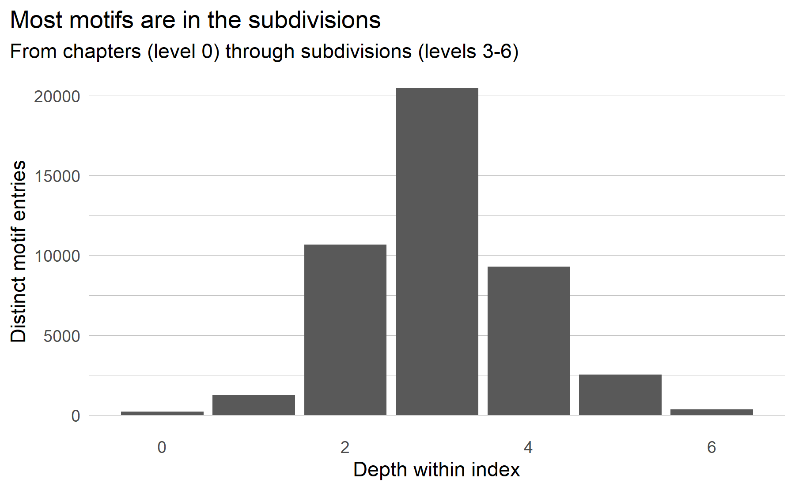
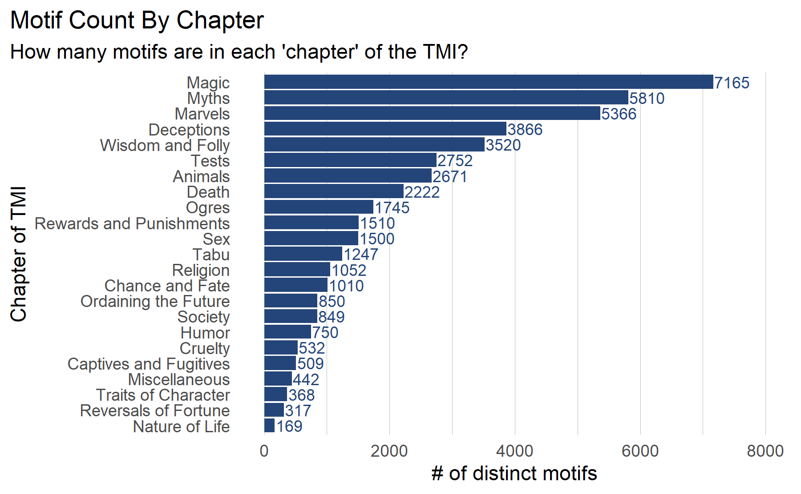

Yarlott and Finlayson (2016) counted “46,248 motifs and sub-motifs,
41,796 of which have references to tales or tale types.” Whereas the
difference is minimal, and it is unclear what they mean by sub-motifs.

Summary of Structure
====================

Brief Review of Thompson’s Structure
------------------------------------

While a complete description of the index structure is provided by
Thompson, in the introductory section entitled ‘Plan of the Work’, it is
worth providing a brief review here. The motifs are nested into larger
and larger groups, culminating in the ‘chapters’ of the index:

*chapter \> grand division \> division \> subdivision(s) \> motif*

Descriptions of each level are provided here, derived from Thompson’s
introduction:

1.  *Chapter*: The largest groupings in the index are called “chapters”.
2.  *Grand Division*: Within each chapter, grand divisions are ranges of
    a hundred numbers, or some multiple of a hundred numbers. E.g.
    B0—B99 concerns mythical animals; B100—B199, magic animals; etc.
3.  *Division*: Within each grand division, divisions are ranges of tens
    or groups of tens. The first (e.g. *B0—B9. Mythical animals —
    general.*) and last (e.g. *B90—B99. Other mythical animals.*)
    divisions serve specific roles: the first “treats the general idea
    of the grand division”, while the last “deals with miscellaneous
    material”. The rest of the intervening divisions deal with “specific
    ideas” (e.g. *B50—B59. Bird-men.*)
4.  *Subdivision(s)*: Within each division (e.g. B10—B19) the
    arrangement follows a similar principle. The first number (ending in
    “0”) refers to the general concept, succeeding numbers to specific
    aspects, and the last to miscellaneous/additional material.

A few observations about this structure are worth noting here:

-   In some cases, items in the miscellaneous division include groups
    which would have been given their own specific grouping (i.e. ending
    in 1-8), except that there was no room left. Thompson prescribes
    that in such cases, “should more items appear than enough to exhaust
    the numbers, these can be added indefinitely to the last number
    (19.1, 19.2, 19.3, etc.).” Usually not all numbers are employed,
    since room is left for indefinite expansion of the classification.

Thompson notes that “It is frequently desirable to subdivide a number.
This is done by pointing, thus: B11. Dragon. — B11.1. Origin of the
dragon. — B11.1.1. Dragon from cock’s egg. — B11.1.2. Dragon from
transformed horse. — B11.2. Form of dragon. — B11.2.1. Dragon as
compound animal. This system of subdivision maybe carried on
indefinitely. Such an item as E501 with more than two hundred
subdivisions will illustrate the manner in which any item may be
subdivided, no matter how elaborate the analysis.”

Motifs have different levels of granularity. Since a motif is defined
simply as the finest-grained level of the structure, subdivisions which
have received greater attention will tend to have more finely
distinguished motifs.

``` r
tmi %>%
  ggplot(aes(x = level)) +
  geom_histogram(stat="count") +
  theme_bar + 
  theme(
    plot.title.position = "plot",
    text = element_text(family = font_family)
  ) +
  labs(
    title = "Most motifs are in the subdivisions",
    subtitle = "From chapters (level 0) through subdivisions (levels 3-6)",
    x = "Depth within index",
    y = "Distinct motif entries"
  )
```



The most populated level of the index (i.e. ‘3’) is that of the initial
*subdivision*, indicating that there are frequently no splits made in
the motif identified. While the index structure would allow for each
subsequent level (i.e. levels 4 - 6+) to have increasing numbers of more
finely grained motifs, these either do not exist or have not been filled
in.

``` r
tmi %>%
  group_by(chapter_name) %>%
  summarize(n = n_distinct(id)) %>%
  ggplot(aes(x = fct_reorder(chapter_name,n), y = n)) +
  geom_col(fill = "#244579FF") +
  geom_text(
    aes(label = n),
    family = font_family,nudge_y = 20,size = 3, hjust =0.01,color = "#244579FF"
  ) +
  labs(
    title = "Motif Count By Chapter",
    subtitle = "How many motifs are in each 'chapter' of the TMI?",
    x = "Chapter of TMI",
    y = "# of distinct motifs"
  ) +
  coord_flip() + theme_bar_flip +
  ylim(c(0, 8000))
```



The entire structure, with each subsection nested within its chapters,
can be represented as a dendrogram, as below:

``` r
ntwk %>%
  ggraph(layout = 'dendrogram', circular = F) + 
  geom_edge_link(alpha = 0.25) +
  theme_graph(base_family = font_family)
```

Because of the size of the TMI, this particular view is not useful for
inspecting specific branches in the tree or nodes

``` r
viz_df %>%
  ungroup() %>%
  ggraph(layout = 'dendrogram', circular = T) + 
  geom_edge_diagonal(alpha = 0.25) +
  geom_node_point(
    aes(
      colour = name,
      filter = leaf,
      size= level * 0.5, 
      alpha=0.2
    )
  ) +
  geom_node_text(
    aes(
      x = x*1.15, y=y*1.15, 
      filter = leaf, 
      label = str_trunc(as.character(motif_name),20,"right"), 
      angle = -((-node_angle(x, y)+90)%%180)+90, 
      hjust ='outward', 
      colour = name
    ), 
    size=2.5, alpha=1
  ) +
  # scale_fill_paletteer_d(viridis, inferno) +
  coord_fixed() +
  theme_void() +
  theme(
    legend.position="none",
    plot.margin=unit(c(0,0,0,0),"cm")
  ) +
  expand_limits(x = c(-2, 2), y = c(-2, 2))
```

Summarize by Level
------------------
