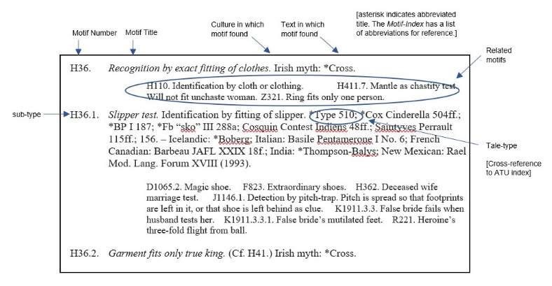
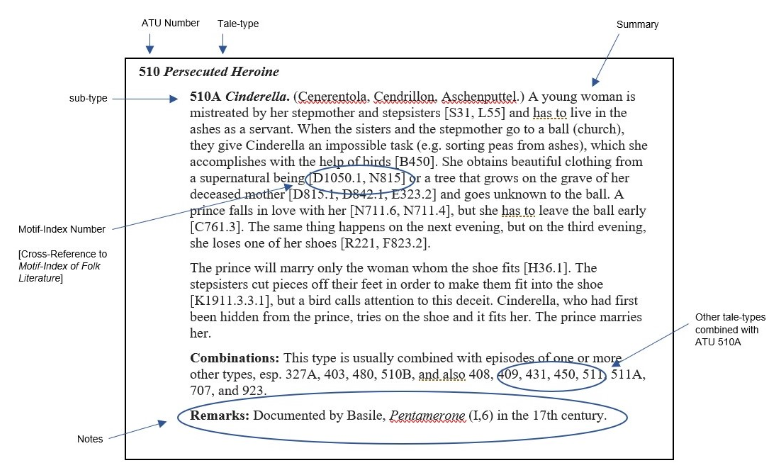
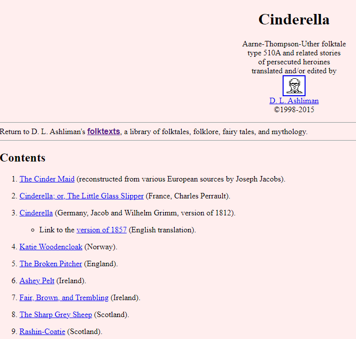

# Trilogy Data Dictionary

## TMI

The `tmi` dataset contains the Thompson Motif Index (TMI), with each row representing a single motif.

#### Variables

- `id`: 
- `chapter_name`:
- `motif_name`:
- `notes`: 
- `level`: 
- `chapter_id`: 
- `level_0`-`level_6`:

## ATU

There are a few datasets derived from the Aarne–Thompson–Uther (ATU) Index published by Hans-Jörg Uther.

### Tale Types

The `atu_df` dataset has one row for each tale type from the index.  The following variables are available for each tale type:

#### Variables

- `chapter`
- `division`
- `sub_division`
- `atu_id`
- `tale_name`
- `litvar`
- `provenance`
- `tale_type`
- `remarks`
- `combos`

### Motif Sequences

The `atu_seq` dataset has one row for each occurrence of a TMI motif within a tale type from the ATU index.  The following variables are available for each occurrence of a motif identified within:

#### Variables

- `atu_id`
- `tale_variant`
- `motif_order`
- `motif`

### Tale Combinations

The `atu_combos` dataset has one row for each possible combination of a given `atu_id` with another `atu_id`, as identified in the ATU Index.  The following variables are available for each combination identified:

#### Variables

- `atu_id`
- `combo`

## AFT

The Annotated Folk Tales (i.e. `aft`) dataset contains folktales that have been marked as characteristic of a specific tale type from the ATU.  It contains one row per tale, and only includes stories with a specified `atu_id`.

#### Variables

- `atu_id`
- `tale_title`
- `provenance`
- `notes`
- `source`
- `text`
- `data_source`
- `date_obtained`

